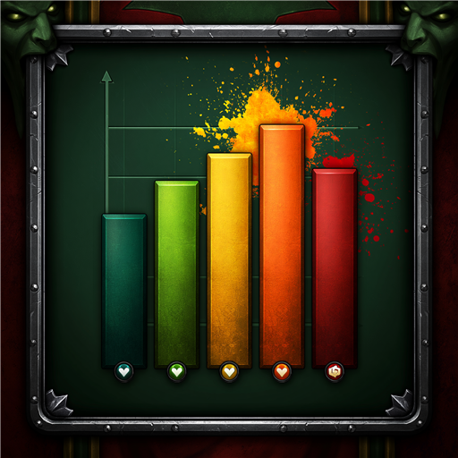

# TrueParse

*A parse that shows you actually did your job.*

TrueParse is a World of Warcraft group meter that grades players on a
**Group Contribution Score** — a 0–99 number in the parse colors you
already know from Warcraft Logs — instead of raw damage or healing.
The score is a **verifiable WCL base plus visible adjustments**: your
throughput measured against real Warcraft Logs percentile curves, then
signed nudges for the rest — kicks earn more on kick-heavy fights,
staying out of the bad gains points and standing in it costs them, and
every bullet shows its exact impact ("Excellent interrupting (+5)").
A tank or healer can top the card just as easily as a DPS.

It also knows things meters don't: it credits an Augmentation Evoker
for the damage their buffs enabled, it detects when the raid leader
called a wipe and stops counting the on-purpose deaths after it, and
its advice names the actual problem ("9 interruptible casts got
through") instead of "do more healing."

Supports retail (Midnight) and Mists of Pandaria Classic.

## What it does

- **Post-fight scorecard**: Details-style ranked rows with per-fight
  scores, run averages, the signed adjustment column, and a merged
  Raid/Group summary row (green dot = running TrueParse). Hover any row
  for a plain-language breakdown sorted best-to-worst — every line that
  moved the score says by how much — with percentile gauges wherever a
  real WCL population backs the number. Personal-best tags on new
  records. Optional **letter grades** (F to S+) via `/tp letters`.
- **Deep, honest detail**: interrupt coverage ("Kicked 7 of 9
  interruptible casts" — the kickable-spell list teaches itself),
  whether tank and healer cooldowns actually met the fight's damage
  spikes, a WCL-style death recap on every death, dispel reaction
  times, healer mana timelines, and Bloodlust usage.
- **Two lenses**, switchable on the window: **TrueParse** (the full
  contribution score) or **Raw** — your true Warcraft Logs percentile
  for this exact boss, bracket, and spec. If you parse 92 on WCL, Raw
  shows 92. Raw disables itself on content WCL doesn't rank instead of
  inventing a number.
- **Fair by construction**: real WCL population curves per encounter,
  spec, and bracket for BOTH damage and healing — a Disc priest's damage
  and a Blood DK's self-healing count the way their populations say they
  should. Metrics your spec can't perform redistribute; mechanics that
  force damage onto you never count against you; fights with nothing to
  heal don't scold healers; item level is normalized (toggleable).
- **A real group story**: the Raid card reads like an analysis, not an
  average — kill speed vs every ranked kill, kick coverage, deaths and
  avoidable pressure as facts, and an execution-vs-parses verdict when
  the group killed faster (or slower) than its meters predict.
- **Augmentation attribution**: an Aug Evoker's card shows their own
  damage plus the damage their buffs enabled ("27.9k own + 18.1k buffs
  enabled"), scored against the real DPS population — calibrated to
  land within a few points of WCL's own attributed parses.
- **Called-wipe forgiveness** (MoP): when group damage output collapses
  and never recovers, the raid stopped trying — avoidable damage,
  deaths, and inactivity after that moment don't count. A wipe fought
  to the last death counts everything.
- **Coach line & wipe debrief**: after bosses, one private line with
  your grade and the single change that would have raised it most;
  after wipes, what happened — deaths, how many followed avoidable
  damage, and the pull's top pointers. Advice is always specific
  ("the healer ran dry in 3 fights"), and a clean run gets none.
- **Awards that mean something**: one per player per fight, rarest
  wins, and winning must be earned — Untouchable goes to a sole dodger,
  Giant Slayer needs a 25% margin, Not on My Watch needs a real fight.
- **Career tracking** (`/tp career`), **run report cards** (`/tp run`),
  and `/tp share` — one line to group chat with the latest kill's time
  vs Warcraft Logs ranked kills plus the group score. Opt-in run
  announcements stay polite: when several TrueParse users have them on,
  they elect ONE announcer over the addon channel — no duplicate lines.
- **Better together**: TrueParse users share their own combat facts
  (defensive cooldowns, consumables, activity, defensives sitting ready
  at death) over a hidden addon channel — data Blizzard hides from
  everyone except the player themselves. These nudge the score a few
  points at most; a player without the addon still gets an accurate
  base score, and missing data is always neutral, never a penalty.

## Install

[CurseForge](https://www.curseforge.com/wow/addons/trueparse), or drop the
folder into `Interface/AddOns/`. Left-click the minimap icon for the
scorecard, right-click for options (`/tp config`).

## Commands

`/tp help` lists everything in-game. Highlights: `/tp` toggle window ·
`/tp mode` TrueParse/Raw · `/tp letters` letter grades · `/tp run` run
report · `/tp share` post group summary · `/tp career` · `/tp trends` ·
`/tp fights` history · `/tp score [n]` · `/tp buffs` pre-pull diagnostic ·
`/tp ilvl` · `/tp coach` · `/tp announce`

## How scoring works (short version)

**Score = WCL base + adjustments, capped at 99** (100 doesn't exist,
same as Warcraft Logs). The base is what's verifiable for every player,
addon or not: damage and healing measured against **Warcraft Logs
percentile curves** sampled from the full ranked population for your
spec, on that boss, in your bracket (10/25-player on Classic;
Normal/Heroic/Mythic on retail; timed-top-run curves for dungeons),
split per spec by its own population's damage/healing mix — plus tank
soak share. When your exact spec+bracket has no curve, the fallback
ladder was calibrated by measuring six million parses: your spec on
other bosses first, then ratio-corrected neighboring difficulties,
then role pools — and the tooltip names the population used.

Everything else is a **signed, context-scaled adjustment on top**:
kicks swing up to ±6 on a kick-heavy fight and barely register on a
quiet one; dispels ±4; staying out of avoidable damage earns up to +3
while eating it costs up to −15; deaths, threat accidents (5-mans),
and missing raid buffs subtract; cooldowns that meet damage spikes,
activity, preparation, Bloodlust usage, and combat rezzes nudge. The
net adjustment caps at ±15, so a score never drifts far from its
verifiable core, and every bullet shows its exact points. The scoring
engine is pure Lua with a headless test suite.

## Known limitations

- **English clients get the sharpest data**: encounter matching keys on
  English names today, so non-English clients fall back to wider
  population pools. Keying by encounter ID is planned.
- On retail, Blizzard hides other players' casts and mid-combat values
  ("secrets"), so combat-log-based extras (Bloodlust windows, damage-target
  splits, defensives for non-TrueParse players) are MoP-Classic-only.
- Dungeon comparisons on normal/heroic/Timewalking use the dungeon's
  timed-top-run curves — honestly labeled as such, since WCL doesn't
  rank those difficulties separately. Delves, follower dungeons, and
  scenarios aren't captured at all (nothing to compare against).
- On retail, Blizzard blocks automated chat from addons: run
  announcements show a one-click Post prompt instead of auto-sending.

Bug reports and requests: [GitHub issues](https://github.com/Rathe001/TrueParse/issues).

## Where the data comes from

All Warcraft Logs statistics (percentile curves, kill times, spec
benchmarks in `Data/*.lua`) **ship inside the addon** — users never fetch
anything, and every addon update carries refreshed data. The addon nags
in-game once shipped data is 60+ days old, which just means it's time to
update.

## Development

**Maintainer data refresh** (never needed by users): the `scripts/`
crawlers regenerate the `Data/` files from the Warcraft Logs API —
`fetch-percentiles-v2.ps1` (percentile curves, V2 client credentials in
`scripts\wcl-v2-client.local.txt`), `fetch-killtimes.ps1` (kill-speed
curves), and `fetch-benchmarks.ps1` (spec factors, V1 key in
`scripts\wcl-key.local.txt`; both files gitignored). Zone IDs change each
season — list them via the API and update
`.github/workflows/benchmarks.yml` to match. Run one crawler at a time:
WCL V2 tokens are single-active.

1. Clone anywhere; run `scripts\link-addon.ps1` to junction the repo into
   `_retail_\Interface\AddOns` (repeat with your Classic path if wanted).
2. `/reload` after changes; BugSack + BugGrabber recommended.
3. Headless tests: `lua tests/run.lua [path-to-SavedVariables]`.

Releases: push a `v*` tag; the packager workflow builds and uploads to
CurseForge (secret: `CF_API_KEY`).

## Credits

Benchmark data derived from [Warcraft Logs](https://www.warcraftlogs.com)
public statistics. Built on Ace3, LibSharedMedia, LibDataBroker, LibDBIcon.
MIT licensed.
